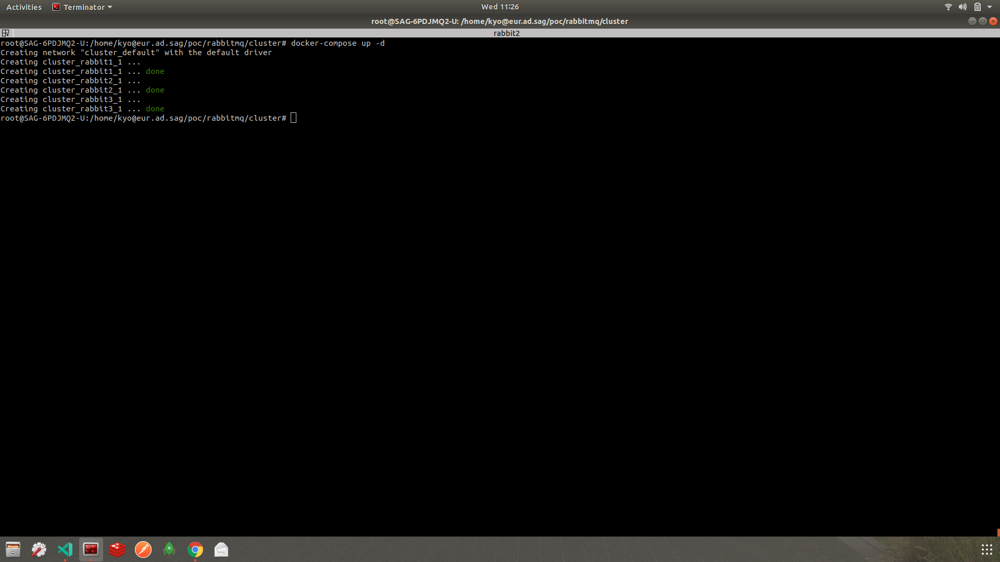
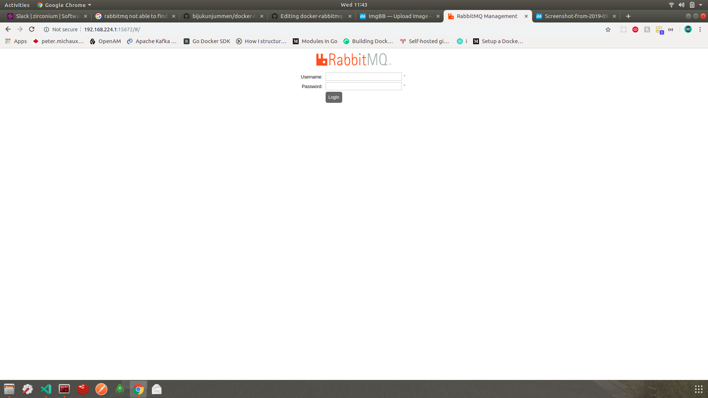
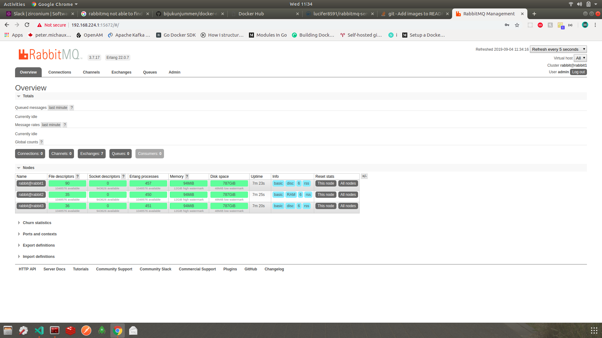
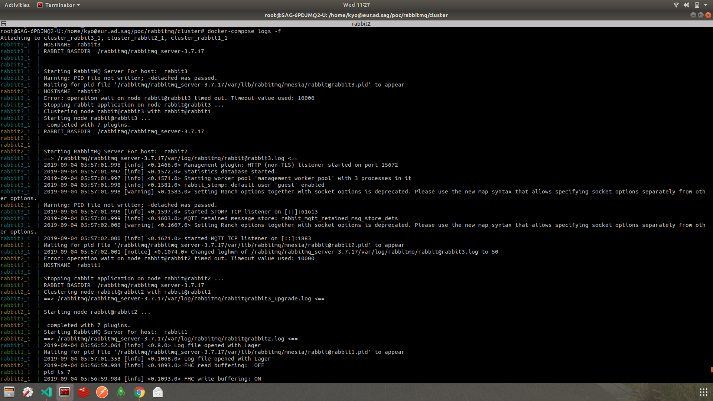

## RabbitMQ Cluster
Docker images to run RabbitMQ cluster. It uses RabbitMQ 3.7.17 for deploying set of 3 nodes rabbit1, rabbit2, rabbit3.
Number of nodes are configurable.

## Resources

There are 3 folders.

- base :   It contains the Dockerfile to download and build rabbitmq base image
- erlang:  It contains the Dockerfile to build erlang-alpine that will be used by RabbitMQ
- server:  It contains the Dockerfile to build RabbitMQ server. It used rabbitmq_base as base image
- cluster: It contains docker-compose file to launch the cluster of RabbitMQ nodes

## Usage

For running RabbitMQ Single node follow below steps
```
  docker pull lucifer8591/rabbitmq-server:3.7.17
  docker run  lucifer8591/rabbitmq-server:3.7.17
```

Visit the http://<docker-ip>:15672 to view management console

NOTE:
guest user will not be able to login to management ui as it supports only localhost

### Environment Variables
RABBITMQ_DEFAULT_USER: Set default Administrator user ```default admin```
RABBITMQ_DEFAULT_PASS: Set password for default user ```default admin```

### Launching Cluster
Add docker-compose file available in cluster directory to your project directory and run below command

```
docker-compose up -d

```

### Compose Config
```
version: "3"
services:
  rabbit1:
    image: lucifer8591/rabbitmq-server:3.7.17
    hostname: rabbit1
    ports:
      - "5672:5672"
      - "15672:15672"
    environment:
      - RABBITMQ_DEFAULT_USER=${RABBITMQ_DEFAULT_USER:-admin}
      - RABBITMQ_DEFAULT_PASS=${RABBITMQ_DEFAULT_PASS:-admin}
  rabbit2:
    image: lucifer8591/rabbitmq-server:3.7.17
    hostname: rabbit2
    links:
      - rabbit1
    environment:
      - CLUSTERED=true
      - CLUSTER_WITH=rabbit1
      - RAM_NODE=true
    ports:
      - "5673:5672"
      - "15673:15672"
  rabbit3:
    image: lucifer8591/rabbitmq-server:3.7.17
    hostname: rabbit3
    links:
      - rabbit1
      - rabbit2
    environment:
      - CLUSTERED=true
      - CLUSTER_WITH=rabbit1
    ports:
      - "5674:5672"
```

### Clusters Launching Progress 


### Management UI
Manage UI is accssible using localhost:15672 or http://<dockerip>:15672 i.e in my case it is http://192.168.224.1:15672. You can find docker ip using docker network inspect network_name




### Management Dashboard 


### Compose Logs
To view logs when RabbitMQ is launched as screenshot
```
docker-compose logs -f 
// or for specific node logs
docker-compose logs -f rabbit1
```


### Future TODO's
- HA proxy
- Swarm deployment
- Custom logging

___

Happy Coding :grinning: 

Contact: kailashyogeshwar85@gmail.com
